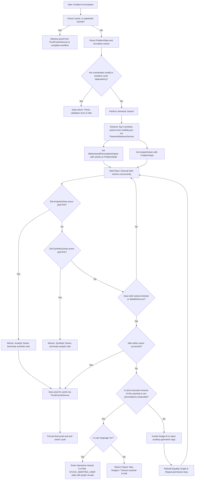

# Geometry Solver Architecture and Decision Logic

> **Note:** If you are looking to explore the general codebase layout physically and structurally, please see the [System Architecture Schematic & Structural Map](./SYSTEM_ARCHITECTURE_MAP.md) which maps files, dependency graphs, and execution boundaries.

This document provides a comprehensive technical overview of the Dual-Solver Engine’s architecture, logical workflows, decision-making logic, validation gates, and execution flows within the codebase.

---

## 1. The Master Logical Flowchart

The following Mermaid.js diagram visualizes the primary execution path and decision logic of the dual-solver race.



---

## 2. Conditional "If-Then-Else" Logic Matrix

| Phase | IF (Input Condition / Gate) | THEN (Action / Side Effect) | ELSE IF (Alternative Gate) | THEN (Alternative Action) | ELSE (Default Fallback) |
| :--- | :--- | :--- | :--- | :--- | :--- |
| **Cache Check** | State hash matches `ProofCacheService` registry | Load verified proof structure representing targets directly from JSON store. | *N/A* | *N/A* | Execute cold execution pipeline starting solvers race. |
| **Active Primitive Search** | State has Triangle element, but no Circle or Quadrilateral | Filter primitive candidates in `mathlib.json` to exclude theorems matching circle or quadrilateral signatures. | State has Circle element, but no Triangle or Quadrilateral | Filter primitive candidates in `mathlib.json` to exclude theorems matching triangle or quadrilateral signatures. | Return all generic primitives (e.g. alignment / coordinate congruence equations). |
| **Permutation Step** | Elements length equals 2 (Segment identifiers AB, BA, etc.) | Sort identifier strings alphabetically to guarantee canonical representation (`BA` maps to `AB`). | Elements length equals 3 (Angle identifiers ABC, CBA, etc.) | Reorder ray points symmetrically around vertex center (`CBA` maps to `ABC`). | Keep literal identifier as-is. |
| **Analytic Check** | Target predicate is `Equal` with segment elements | Yield polynomial of differences: `(pA.x - pB.x)^2 + (pA.y - pB.y)^2 - (pC.x - pD.x)^2 - (pC.y - pD.y)^2 = 0`. | Target predicate is `Perpendicular` on lines | Yield dot product equation of line vectors: `v1x * v2x + v1y * v2y = 0`. | Yield cross product equation (or `Isosceles` side difference poly) depending on matches. |
| **Synthetic Termination** | Forward group facts intersect with backward requirement goals | Halt execution loop, resolve promise, and return proof chain. | Permutations exhausted with no progress on iteration steps | Evaluate nudge requirements. | Execute next incremental forward and backward permutations. |
| **Deterministic Exhaustion** | Progress has stalled (no new knowns or requirements generated) and `nudges_used < 5` | Call get_nudge() to invoke fallback nudge model suggestions, insert returned rule, and rebuild graph. | Progress has stalled, `nudges_used >= 5`, and language is `'en'` | Yield `'STUCK_AWAITING_USER'` system state to solicit manual user coordinate configurations. | Halt execution and return general engine error output. |

---

## 3. Validation & Guard Gates

Several validation gates safeguard the solver loop from entering infinite recursions or executing on structurally garbage input.

### Coordinate Struct Integrity Gate
```typescript
if (!entities || !Array.isArray(entities)) {
  throw new Error("Invalid entity array: Cannot process empty or missing geometry structures.");
}
```
* **Trigger:** Pre-computation.
* **Impact:** Immediate halt. Rejects problem formulations without entities.

### Unreachable Point References
```typescript
const points = ProblemState.entities.filter(e => e.type === "Point");
const pointMap = new Map();
// If any line, angle, triangle, or circle references a point ID that is not present in the point configuration:
if (entity.points.some(id => !pointMap.has(id))) {
  throw new Error(`Referenced point ID "${id}" is missing from coordinate registration.`);
}
```
* **Trigger:** Pre-computation.
* **Impact:** Immediate halt. Rejects incomplete geometric specifications.

### Execution Timeout Guards
```typescript
const MAX_COMPUTE_TIME = 45000; // 45 seconds strict limit
if (Date.now() - startTime > MAX_COMPUTE_TIME) {
  return { success: false, proofChain: this.knowns, timeout: true };
}
```
* **Trigger:** Run inside the solver race loop iteration.
* **Impact:** Halts both background processes, stops search loops, returns partial facts to safeguard the local UI main thread from blocking.

---

## 4. State-Driven Behavior

The engine behaves selectively based on state transitions, switching from strict algorithmic searching to user-intervention pipelines depending on active criteria:

### State `NORMAL_PROCESSING`
* **Characteristics:** `nudges_used < 5` and solver loop is producing novel properties.
* **Entity Actions:**
  * **Analytic Solver:** Iteratively replaces variables in `currentGoal` using algebraic substitution.
  * **Synthetic Solver:** Executes forward and backward propagation steps.
  * **Nudge AI:** Standby until progress stalls.

### State `PROGESS_STALLED`
* **Characteristics:** Loop yields zero new forward facts AND zero new backward requirements.
* **Entity Actions:**
  * **If `nudges_used < 5`:** Transitions to invoking the model API for an auxiliary construct ("nudge"). Appends the construct to `knowns` and continues processing.
  * **If `nudges_used >= 5` and user language is `'en'`:** Transitions immediately to `STUCK_AWAITING_USER`.
  * **If `nudges_used >= 5` and user language is NOT `'en'`:** Direct failure termination.

### State `STUCK_AWAITING_USER` (Human Co-Pilot Active)
* **Characteristics:** Solver is out of automated steps, but eligible for manual intervention because language matches English localization patterns.
* **Entity Actions:**
  * Halts computation and yields active visual representation map elements (`nodes` and custom `links` denoting currently confirmed equivalence).
  * Opens UI options for users to click, adjust coordinates, or trace step-by-step logic visually.

---

## 5. High-Level Logical Pseudocode

The following language-agnostic pseudocode outlines the orchestration and parallel racing of both solvers.

```python
function SOLVE_GEOMETRY_PROBLEM(problemState, language):
    stateHash = compute_md5(problemState)
    
    # Cache lookup
    if has_cached_proof(stateHash):
        return get_cached_proof(stateHash)
        
    # Validation gates
    if not is_valid_state(problemState):
        throw ValidationError("Structural error in points, angles, or segments configuration")
        
    activeTheorems = TheoremRetrieverService.retrieveTopK(problemState, 15)
    
    # Initialize both solver routines
    syntheticEngine = BidirectionalPermutationEngine(problemState, activeTheorems)
    analyticEngine = AnalyticSolver(problemState)
    
    # Define parallel promises
    syntheticPromise = async_run(syntheticEngine.solve())
    analyticPromise = async_run(analyticEngine.solve())
    
    # Execution Race Control
    raceFinished = false
    winner = null
    proofChain = []
    
    execute_race_loops:
        while not raceFinished:
            if syntheticPromise.completed_successfully():
                raceFinished = true
                winner = "synthetic"
                result = syntheticPromise.get_result()
                proofChain = result.proofChain
                break
                
            if analyticPromise.completed_successfully():
                raceFinished = true
                winner = "analytic"
                result = analyticPromise.get_result()
                proofChain = result.proofChain
                break
                
            if both_tasks_failed_or_timed_out():
                raceFinished = true
                result = handle_solver_stuck(syntheticEngine, problemState, language)
                break
                
    if result.success:
        canonicalizedProof = normalize_elements(proofChain)
        save_to_proof_cache(stateHash, canonicalizedProof)
        return canonicalizedProof
    else:
        return result
```
