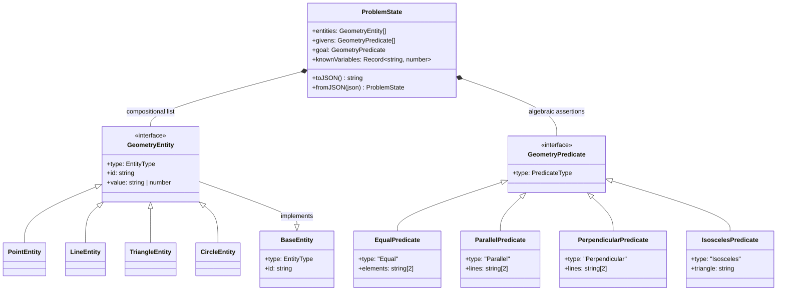

# Neuro-Symbolic Geometry Theorem Prover: System Architecture Schematic & Structural Map

This document provides a highly detailed architectural analysis, structural layout, dependency mapping, and execution flow of the **Actual Math** neuro-symbolic geometry theorem prover codebase.

---

## 1. Physical File & Module Tree

This map captures the physical layout of the repository, highlighting directories and files hosting the core business logic, algebraic computation engines, and AI orchestration pipelines.

| Path | File/Module | Structural Responsibility (One-Sentence Summary) |
| :--- | :--- | :--- |
| **`src/`** | Core Application Source | Root folder containing all React views, components, and mathematical solver components. |
| `src/App.tsx` | Main Controller | Acts as the primary orchestrator, managing coordinate snapping, AI models, local states, and routing solver races. |
| `src/types.ts` | Shared Type Schema | Declares standard geometry types (`Point`, `Segment`, `Relation`, `DslPayload`) utilized across front-end models and CAS. |
| **`src/components/`** | Presentation Components | Directory containing reactive and modularized UI elements for rendering graph, input, and proofs. |
| `src/components/GraphPane.tsx` | JSXGraph Visualizer | Sub-component setup managing canvas drawing, auto-scaling, dynamic bounding boxes, and ResizeObserver hooks for JSXGraph. |
| `src/components/InputPane.tsx` | Input & Upload Gate | Manages files uploading, drag-and-drop actions, Tesseract-based question detection, and native-language inputs. |
| `src/components/ProofPane.tsx` | LaTeX Typesetter | Renders step-by-step math proofs using KaTeX typesetting blocks alongside localized rate-limit warnings. |
| `src/components/LanguageSelector.tsx`| Localization Toggle | Simple layout dropdown for toggle-switching between English, Khmer, Spanish, Arabic, French, and Chinese. |
| `src/components/TutorialModal.tsx` | Guide Overlay | Interactive onboarding walkthrough showing how to feed geometric problems and use private keys. |
| **`src/lib/`** | Neuro-Symbolic Libraries | Directory hosting full deterministic algorithms, RAG services, cache mechanisms, and mathematical parsers. |
| `src/lib/engine.ts` | Discrete Logic Engine | Implements the `BidirectionalPermutationEngine` which matches axioms forward/backward and uses disjoint-set union-find for rapid equality. |
| `src/lib/analytic_solver.ts` | Algebraic Wu's Method | Converts geometric states into polynomial ideals and runs a simplified Wu's method for coordinate deduction. |
| `src/lib/analytic.ts` | Vector & Slopes Pipeline | Proves parallel/orthogonal relations by translating vector formulas and testing dot/cross-product equations using nerdamer. |
| `src/lib/geometryEngine.ts` | Coordinate Relaxation | Solves physical underconstrained nodes using Spring-Mass relaxation algorithms and break-collinearity algorithms. |
| `src/lib/validator.ts` | Domain Guardian | Inspects semantic invariants such as the Triangle Inequality, parallel intersections, angle sums, and division by zero. |
| `src/lib/casUtility.ts` | Nerdamer Wrapper | Wraps nerdamer to solve, evaluate, and validate symbolic expressions for algebraic geometric relations. |
| `src/lib/proofCache.ts` | Experience Flywheel | Standardizes the ProblemState into canonical names and runs local hashes to bypass AI inference with quick caching.|
| `src/lib/locus.ts` | Parametric Solver | Tracks free variables in algebraic coordinates and samples lists of coordinates to display parametric sliders. |
| `src/lib/blur.ts` | Optical Health Checker | Calculates image sharpness using Laplacian variance to prevent blurry uploads. |
| `src/lib/crypto.ts` | Api Key Protectors | Encodes and decodes user-supplied API keys using Base64 obfuscation for localStorage/transit. |
| `src/lib/prompts.ts` | AI Instruction Set | Holds structural LLM prompts for Parser model (Generator), Validator (Critic), and polyglot explanation models. |
| `src/lib/i18n.ts` | Translation Key Map | High-fidelity dictionary mappings for KH, ES, AR, FR, ZH, and EN strings. |
| `src/lib/mathlib.json` | Vector db Mock | Large JSON corpus representing geometry theorems with triggers, rules, and mathematical signatures.|
| **`worker/`** | Headless API Proxy | Standard Cloudflare Worker forwarding client LLM requests to Google Generative Language service using corporate keys. |
| **`my-geometry-proxy/`** | Decrypting BYOK Proxy | Specialized Cloudflare proxy decoding Bearer envelopes and appending decrypted keys before reaching Gemini. |
| **`scripts/`** | Ingestion & Tooling | Offline typescript ingestion script for parsing static axioms into static indexes. |

---

## 2. Dependency & Import Graph

### Architectural Hierarchy
The system uses an asymmetric structural design partitioned into three distinct vertical layers:
- **Presentation (Components)**: Highly reactive, consumer-only UI layers.
- **Deductive Core (`src/lib/...`)**: Interconnected libraries executing domain logic; independent of UI but tightly paired with algebra mechanics.
- **Data Schemas & Utilities**: Core primitives (`types.ts`, `dsl.ts`, `casUtility.ts`) behaving as absolute leaves.

```mermaid
graph TD
    %% UI Components
    App[src/App.tsx]
    GraphPane[src/components/GraphPane.tsx]
    InputPane[src/components/InputPane.tsx]
    ProofPane[src/components/ProofPane.tsx]
    TutorialModal[src/components/TutorialModal.tsx]
    LangSelector[src/components/LanguageSelector.tsx]

    %% Main controller feeds components
    App --> GraphPane
    App --> InputPane
    App --> ProofPane
    App --> TutorialModal
    App --> LangSelector

    %% Utility Libraries in lib
    i18n[src/lib/i18n.ts]
    blur[src/lib/blur.ts]
    crypto[src/lib/crypto.ts]
    prompts[src/lib/prompts.ts]
    locus[src/lib/locus.ts]
    geomEngine[src/lib/geometryEngine.ts]
    engine[src/lib/engine.ts]
    proofCache[src/lib/proofCache.ts]
    analyticSolver[src/lib/analytic_solver.ts]
    analytic[src/lib/analytic.ts]
    validator[src/lib/validator.ts]
    casUtility[src/lib/casUtility.ts]
    dsl[src/lib/dsl.ts]
    types[src/types.ts]
    mathlib[src/lib/mathlib.json]

    %% App Imports
    App --> i18n
    App --> blur
    App --> crypto
    App --> geomEngine
    App --> engine
    App --> proofCache
    App --> analyticSolver
    App --> dsl
    App --> types

    %% Library couplings
    engine --> dsl
    engine --> casUtility
    engine --> mathlib
    
    analyticSolver --> dsl
    analyticSolver --> casUtility

    analytic --> dsl

    proofCache --> dsl
    proofCache --> validator

    validator --> dsl
    validator --> casUtility

    locus --> dsl
    locus --> casUtility

    types --> locus
```



### Topological Roles
*   **Root Orchestrator (Imported by none; imports many)**: `src/App.tsx` behaves as the sole system controller.
*   **Logical Leaf Modules (Imported by many; imports none)**:
    *   `src/types.ts`: Declares shared structural interfaces.
    *   `src/lib/casUtility.ts`: Performs atomic symbolic mathematics (Nerdamer wrapper).
    *   `src/lib/mathlib.json`: Static database containing rule arrays for theorem triggering.
    *   `src/lib/i18n.ts`: Localization key maps.

### Circular Dependencies & Tight Coupling
*   **The DSL Coupling**: Almost all engine modules (`engine.ts`, `analytic_solver.ts`, `analytic.ts`, `validator.ts`, `proofCache.ts`, `locus.ts`) import `ProblemState` or related types directly from `src/lib/dsl.ts`. They are structurally coupled around this domain model.
*   **No Circular Loops Found**: The modules trace a clean, acyclic dependency tree. Circular references (such as `A -> B -> A`) have been fully avoided. For instance, `validator.ts` provides structural validation for `proofCache.ts`, but `validator` itself makes no backward imports to caches.

---

## 3. Data & Type Anatomy

### Core Data Structures
The following markdown schema formalizes the mathematical data representation of geometry puzzles flowing through the neurotic-symbolic pipelines:

```typescript
// Shared Types (src/types.ts)
export interface Point {
  x: number;
  y: number;
  label: string;
}

export interface Segment {
  p1: string;
  p2: string;
}

export interface Relation {
  relation: string;     // e.g., "CYCLIC", "COLINEAR"
  points?: string[];
  lines?: string[];
  elements?: string[];
  theorem?: string;
}

export interface DslPayload {
  archetype?: "synthetic" | "analytic" | "discrete";
  points: Point[];
  segments: Segment[];
  relations?: Relation[];
  axis?: boolean;
  locusPath?: LocusPath;
}

// Domain Model Primitives (src/lib/dsl.ts)
export type EntityType = 'Point' | 'Line' | 'Angle' | 'Triangle' | 'Circle' | 'Quadrilateral';

export interface BaseEntity {
  type: EntityType;
  id: string; // Coordinate name or algebraic expression key
}

export type GeometryEntity = 
  | PointEntity 
  | LineEntity 
  | AngleEntity 
  | TriangleEntity 
  | QuadrilateralEntity
  | CircleEntity;

export type PredicateType = 'Equal' | 'Parallel' | 'Perpendicular' | 'Isosceles' | 'Similar' | 'Congruent' | 'AlgebraicEvaluation';

export type GeometryPredicate = 
  | EqualPredicate 
  | ParallelPredicate 
  | PerpendicularPredicate 
  | IsoscelesPredicate 
  | SimilarPredicate 
  | CongruentPredicate
  | AlgebraicEvaluationPredicate;
```

### UML Map of Structural Entities
Representing parent-child compositions, parameter dependencies, and constraints mapping:



### Cardinality & Structural Relationships
1.  **`ProblemState` to `GeometryEntity` (1 : Many)**: A single mathematical task encloses multiple concrete vertices, shapes, and segments.
2.  **`ProblemState` to `GeometryPredicate` (1 : Many)**: Represents the multi-constraint algebraic facts given at spawn, plus the single verified target goal.
3.  **`GeometryPredicate` to `GeometryEntity` (Many : Many)**: Predicates link multiple coordinate entities together (e.g., perpendicularity requires a tuple composed of two line entities; equality links angles or lengths).

---

## 4. The Core Execution Flow (Control Structure)

This sequence traces a complete user-driven cycle—starting with raw input processing (an image of a triangle) to programmatic logical verification up to final user rendering.

```mermaid
sequenceDiagram
    autonumber
    actor User as Pilot User
    participant App as src/App.tsx
    participant Blr as src/lib/blur.ts
    participant LLM as CF Proxy (/v1beta/)
    participant Ca as src/lib/proofCache.ts
    participant Det as Deterministic Solver Race
    participant JXG as src/components/GraphPane.tsx
    participant Prf as src/components/ProofPane.tsx

    User->>App: Submits Problem (Drag Image + Text Query)
    App->>Blr: calculateBlurScore(ImageBlob)
    Blr-->>App: Returns Laplacian Variance
    
    rect rgb(20, 20, 20)
        Note over App, LLM: pass 1: Classification Gate
        App->>LLM: Classifies problem (synthetic vs analytic) using gemini-flash-lite-latest
        LLM-->>App: Returns archetype, complexity, & sanity checks
    end

    rect rgb(30, 30, 30)
        Note over App, LLM: pass 2: AST Parsing
        App->>LLM: Extracts problem state using generator model (JSON Schema)
        LLM-->>App: Returns problem raw AST (entities, givens, goal)
    end

    App->>Ca: canonicalizeState(parsedProblemState)
    Ca->>Ca: Computes State Hash
    Ca->>Ca: Queries localStorage cache DB
    
    alt Experience cache hit!
        Ca-->>App: Bypasses inference; immediately maps canonical variables
    else Experience cache miss!
        Note over App, Det: pass 3: Deterministic Prover Race
        App->>Det: Launces Parallel Race: AnalyticSolver vs BidirectionalPermutationEngine
        
        par Synthetic Permutation (Bidirectional)
            Det->>Det: Runs Disjoint-Set union-find on equality graphs
            Det->>Det: Runs forward axioms & backward goal decompositions
        and Coordinate Polynomials (Analytic)
            Det->>Det: Sets rigid framework coordinates (A=(0,0), B=(x,0))
            Det->>Det: Computes Wu's method pseudo-division using nerdamer
        end

        Det-->>App: Whichever solver finishes first with remainder 0 wins!
        App->>Ca: Saves proven canonical proof chain to cache
    end

    rect rgb(40, 40, 40)
        Note over App, LLM: pass 4: Polyglot Explanatory Synthesis
        App->>LLM: Queries streaming model with verified theorem trace
        loop SEC Chunk Handshake
            LLM-->>App: SSE streams step-by-step LaTeX-typeset mathematical proof
            App->>Prf: Progressively typesets text via LaTeX math block filters
        end
    end

    App->>App: autoSnapPoints() on coordinates
    App->>App: Runs Pigeonhole Validator on sunny lines ratios
    App->>JXG: Dispatches DslPayload to update board
    JXG->>User: Draws geometric diagram & snaps ticks on active HTML grid
```

---

## 5. Structural Boundaries

Maintaining physical modularity and isolating responsibilities is critical to avoiding unstable coupling. This section audits where those boundaries lie and highlights code structures crossing them.

```
       [ PRESENTATION LAYER ]
              App.tsx
         /       |       \
        /        |        \
[GraphPane]  [InputPane]  [ProofPane]
   ==================================== <--- Structural Boundary: UI State Isolation
       [ DETERMINISTIC CALCULUS LAYER ]
          * BidirectionalPermutationEngine
          * AnalyticSolver (Wu's Method)
          * Locus parametric sampler
   ==================================== <--- Structural Boundary: AST Translation Gate
         [ PERSISTENCE & UTILITIES ]
            * ProofCacheService (LocalDB)
            * ExistenceValidatorService
            * CASUtility symbols
```

### Boundaries Definition
1.  **UI vs Computations (Presentation Boundary)**: 
    *   *The Rule*: React views (`App.tsx`, `ProofPane.tsx`, `GraphPane.tsx`) should only listen to, read, or trigger computations. They must never directly evaluate symbols or execute logic steps inside rendering loops.
    *   *Status*: **Highly Clean**. All mathematical computations, graph walks, union-find indices, and polynomial divisions are isolated in standard, testable TypeScript classes in `src/lib/`.
2.  **AI Orchestration vs Determinism (Inference Boundary)**:
    *   *The Rule*: AI models are probabilistic and handle translators and structural parsers. Geometric truth must exclusively be certified by deterministic solver pipelines (`analytic_solver.ts` or `engine.ts`). 
    *   *Status*: **Robustly Executed**. The AI is merely a translator. The proof displayed is programmatically verified by either the coordinate matrix (Wu's Method) or the synthetic logic engines.
3.  **Local storage vs Server API Boundaries**:
    *   *The Rule*: The application is client-side driven with API support. The Cloudflare Workers handle vector storage and API proxies, leaving state management to clean client-side localStorage.

### Boundary Violations (Areas of Concern)
*   **Coordinate Manipulation in UI Orchestrator (`App.tsx`)**:
    *   *The Violation*: Lines 42 to 92 in `App.tsx` implement `autoSnapPoints()`, which directly modifies the coordinates of the array of points based on linear intersections and segment snapping. 
    *   *Why it's a concern*: `autoSnapPoints` is a purely mathematical geometry operation that performs rounding, parallel/vertical snapping and coordinate adjustments. Placing this in `App.tsx` directly introduces tight coupling between geometry layout calculations and the root view.
    *   *Correction Plan (Refactoring Guide)*: Move `autoSnapPoints` into a specialized utility function in `src/lib/geometryEngine.ts`, importing it cleanly into the orchestrated handler in `App.tsx`.
*   **Localized Math Translating Pipeline (`App.tsx`)**:
    *   *The Violation*: The maincontroller file directly calculates complex model pipelines, matches Geounicode/country code maps dynamically, parses the SSE chunks stream-by-stream, and translates buffer strings.
    *   *Why it's a concern*: This results in file inflation (`App.tsx` is over 1,500 lines long) which increases load times and challenges general maintainability.
    *   *Correction Plan*: Refactor model selection pipelines, SSE readers, and translation proxies out into an independent module `src/lib/pipeline.ts`.
